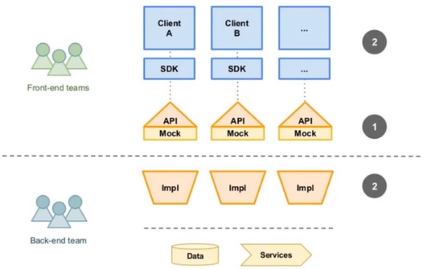

# APIs Día Uno

Día uno del curso de APIs.

## CoE-APIs

Es el área encargada de gestionar la exposición de la información en productos digitales garantizando la seguridad y reutilización, basado en las mejores prácticas de desarrollo haciendo que el consumo sea sencillo tanto para canales internos como externos, así como promover la estadarización y la capacitación en construcción de APIs.

## API

Interfaz de Programación de Aplicaciones (Application Programming Interface), es un conjunto de reglas y protocolos que permiten que diferentes aplicaciones se comuniquen entre sí

## Tipos de APIs

Hay dos tipos de APIs: de _dominio_ y de _producto_.

### Dominio

Las APIs de dominio están enfocadas en resolver una necesidad en específico, por ejemplo, un API de Clientes se debe enfocar en resolver todo lo relacionado con el dominio de Clientes (alta, baja, actualización y búsqueda) del recurso en sí.

Estas APIs resuelven una necesidad de nuestros clientes, en la que se necesita gestionar (CRUD) el dominio del recurso

## Producto 

Un API de Producto es la combinación u orquestación de varias APIs de Dominio para crear una funcionalidad más compleja originando nuevos flujos de negocio digitales para satifacer las necesidades de nuestros clientes.

**Nota:** cada célula de las diferentes unidades de negocio pueden ofrecer APIs de Dominio y Producto.

## Exposición de APIs

Se refiere a cómo se hacen disponibles las APIs para su uso por parte de usuarios y sistemas. Hay dos tipos: _interno_ y _externo_. Una API puede estar expuesta de manera interna y externa.

### Interno

Las APIs se exponen generalmente a través de una red interna y están destinadas a ser utilizadas por aplicaciones y sistemas dentro de la organización. Estas APIs pueden ser documentadas y puestas a disposición de los desarrolladores internos a través de una plataforma interna de APIs. La exposición de APIs en un ambiente interno puede estar restringida a usuarios y sistemas autorizados y protegida detrás de un firewall o de otras medidas de seguridad.

### Externo

Las APIs se exponen a través de una red pública, como Internet, y están destinadas a ser utilizadas por terceros, incluyendo desarrolladores, socios comerciales y clientes. Las APls expuestas externamente pueden requerir un nivel adicional de seguridad para proteger los datos y sistemas detrás de ellas. Además, las APIs expuestas externamente a menudo deben estar disponibles y documentadas para el público en general.

## Ventajas de trabajar con APIs

- Facilitar la integración entre aplicaciones: Permite que diferentes aplicaciones se comuniquen entre sí de manera eficiente, reduciendo tiempo y esfuerzo en su implementación.
- Mejorar la experiencia del usuario: Al reutilizar las funcionalidades existentes y expuestas en APIs se optimiza el tiempo de desarrollo y su implementación, entregando de forma temprana flujos de negocio.
- Expandir el alcance de los servicios: Al exponer APIs de forma pública permite al grupo, la integración de socios comerciales, aumentando el alcance de sus servicios y atrayendo a nuevos usuarios.
- Generar ingresos: El dueño del flujo de negocio puede cobrar a unidades de negocio o socios comerciales por su uso, lo que puede generar ingresos adicionales.
- Fomentar la innovación: La creación de APIs permite que otros consumidores creen nuevas aplicaciones y soluciones.

## OpenAPI

OpenAPI (OAS) define una interfaz estándar independiente del idioma para las API HTTP que permite que tanto los humanos como las computadoras descubran y comprendan las capacidades del servicio sin acceso al código fuente, la documentación o a través de la inspección del tráfico de red. Cuando se define correctamente, un consumidor puede comprender e interactuar con el servicio remoto con una cantidad mínima de lógica de implementación.

## Metodología Contract First

Es una estrategia que consiste en desarrollar el contrato de interfaz de un API. Una vez que se tiene el contrato definido, hay la garantía de que los datos que obtendrá el consumidor serán tal cual están en el contrato, por lo que el frontend y backend pueden iniciar en paralelo sus implementaciones.

Esta estrategia permite el consumo de la funcionalidad del API de manera temprana a través de Mocks (respuestas simuladas), cuando el backend aún no está disponible.

